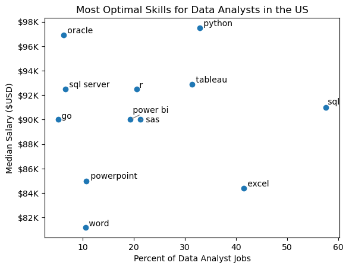

# Overview
This project explores the landscape of the data job market, with a specific focus on Data Analyst positions. It was inspired by a personal goal: to better understand current job trends and identify high-value opportunities in the field.

The dataset comes from Luke Barousse's Python course and includes detailed information on job titles, salary ranges, locations, and required skills. Using Python, I analyze this data to answer key questions such as which skills are most in demand, what the current salary trends look like, and how salary and skill demand overlap in the data analytics space.

# The Questions
Below are the questions I want to answer in my project:

1. What are the skills most in demand for the top 3 most popular data roles?
2. How are in-demand skills trending for Data Analysts?
3. How well do jobs and skills pay for Data Analysts?
4. What are the optimal skills for data analysts to learn? (High Demand AND High Paying)

# Tools I Used
For my deep dive into the data analyst job market, I harnessed the power of several key tools:

- Python: The backbone of my analysis, allowing me to analyze the data and find critical insights.I also used the following Python libraries:
   - Pandas Library: This was used to analyze the data.
    - Matplotlib Library: I visualized the data.
    - Seaborn Library: Helped me create more advanced visuals.
- Jupyter Notebooks: The tool I used to run my Python scripts which let me easily include my notes and analysis.
- Visual Studio Code: My go-to for executing my Python scripts.
- Git & GitHub: Essential for version control and sharing my Python code and analysis, ensuring collaboration and project tracking.

# Data Preparation and Cleanup
This section outlines the steps taken to prepare the data for analysis, ensuring accuracy and usability.
## Import & Clean Up Data
I start by importing necessary libraries and loading the dataset, followed by initial data cleaning tasks to ensure data quality.
```
# Importing Libraries
import ast
import pandas as pd
import seaborn as sns
from datasets import load_dataset
import matplotlib.pyplot as plt  

# Loading Data
dataset = load_dataset('lukebarousse/data_jobs')
df = dataset['train'].to_pandas()

# Data Cleanup
df['job_posted_date'] = pd.to_datetime(df['job_posted_date'])
df['job_skills'] = df['job_skills'].apply(lambda x: ast.literal_eval(x) if pd.notna(x) else x)
```

## Filter US Jobs
To focus my analysis on the U.S. job market, I apply filters to the dataset, narrowing down to roles based in the United States.
```
df_US = df[df['job_country'] == 'United States']
```

# The Analysis
Each Jupyter notebook for this project aimed at investigating specific aspects of the data job market. Here’s how I approached each question:
## 1. What are the most demanded skills for the top 3 most popular data roles?
To find the most demanded skills for the top 3 most popular data roles. I filtered out those positions by which ones were the most popular, and got the top 5 skills for these top 3 roles. This query highlights the most popular job titles and their top skills, showing which skills I should pay attention to depending on the role I'm targeting.

View my notebook with detailed steps here:[2 Skill Demand](3_Project/2_Skills_Count.ipynb)

### Visualize Data
```
fig, ax = plt.subplots(len(job_titles), 1)


for i, job_title in enumerate(job_titles):
    df_plot = df_skills_perc[df_skills_perc['job_title_short'] == job_title].head(5)[::-1]
    sns.barplot(data=df_plot, x='skill_percent', y='job_skills', ax=ax[i], hue='skill_count', palette='dark:b_r')

plt.show()
```
### Results


*Bar graph visualizing the salary for the top 3 data roles and their top 5 skills associated with each.*

### Insights:
- SQL stands out as the top-listed skill for both Data Analysts and Data Scientists, appearing in more than half of all job postings for these positions. In contrast, Python is the leading requirement for Data Engineers, showing up in 68% of listings.

- Data Engineers are expected to have advanced technical expertise in tools like AWS, Azure, and Spark, Data Analysts and Data Scientists typically work with broader, analysis-focused tools such as Excel and Tableau.

- Python remains a highly valuable and widely requested skill across all three roles, with the highest demand seen among Data Scientists (72%) and Data Engineers (65%).

## 2. How are in-demand skills trending for Data Analysts?

To find how skills are trending in 2023 for Data Analysts, I filtered data analyst positions and grouped the skills by the month of the job postings. This got me the top 5 skills of data analysts by month, showing how popular skills were throughout 2023.

View my notebook with detailed steps here: [3_Skill_Trend](3_Project/3_Skills_Trend.ipynb)

### Visualize Data
```
from matplotlib.ticker import PercentFormatter

df_plot = df_DA_US_percent.iloc[:, :5]
sns.lineplot(data=df_plot, dashes=False, legend='full', palette='tab10')

plt.gca().yaxis.set_major_formatter(PercentFormatter(decimals=0))

plt.show()
```

### Results


*Bar graph visualizing the trending top skills for data analysts in the US in 2023.*

### Insights:
- SQL continues to be the most in-demand skill year-round, though its popularity slowly declines over time.

- Excel sees a notable rise in demand beginning in September, eventually overtaking Python and Tableau by year’s end.

- Python and Tableau maintain fairly steady demand with minor ups and downs, remaining key tools for data analysts.

- Power BI, despite being less sought after than the others, shows a modest increase in interest as the year concludes.

## 3. How well do jobs and skills pay for Data Analysts?

To find out which roles and skills offer the highest pay, I focused only on jobs based in the United States and analyzed their median salaries. Before that, I examined the salary distributions for common data roles—such as Data Scientist, Data Engineer, and Data Analyst—to get a sense of which positions tend to earn more.

You can view all the detailed steps in my notebook here:[4_Salary_Analysis](3_Project/4_Salary_Analysis.ipynb)

### Visualize Data
```
sns.boxplot(data=df_US_top6, x='salary_year_avg', y='job_title_short', order=job_order)

ticks_x = plt.FuncFormatter(lambda y, pos: f'${int(y/1000)}K')
plt.gca().xaxis.set_major_formatter(ticks_x)
plt.show()

```

### Results


*Box plot visualizing the salary distributions for the top 6 data job titles.*

### Insights:
- Salaries vary widely depending on the job title. Senior Data Scientist roles stand out with the highest earning potential, reaching up to $600K, highlighting how much the industry values advanced expertise and experience.

- Both Senior Data Engineer and Senior Data Scientist positions show many high-end outliers, indicating that individuals with exceptional skills or unique situations can earn significantly more. In comparison, Data Analyst salaries are more uniform, with fewer extreme cases.

- Median salaries generally rise with role seniority and specialization. Senior-level positions, like Senior Data Scientist and Senior Data Engineer, not only pay more on average but also show a wider salary range, reflecting increased responsibility and variability in compensation.

## Highest Paid & Most Demanded Skills for Data Analysts

Next, I narrowed my analysis and focused only on data analyst roles. I looked at the highest-paid skills and the most in-demand skills. I used two bar charts to showcase these.
### Visualize Data
```
fig, ax = plt.subplots(2, 1)  

# Top 10 Highest Paid Skills for Data Analysts
sns.barplot(data=df_DA_top_pay, x='median', y=df_DA_top_pay.index, hue='median', ax=ax[0], palette='dark:b_r')

# Top 10 Most In-Demand Skills for Data Analystsr')
sns.barplot(data=df_DA_skills, x='median', y=df_DA_skills.index, hue='median', ax=ax[1], palette='light:b')

plt.show()
```

### Results
Here's the breakdown of the highest-paid & most in-demand skills for data analysts in the US:


*Two separate bar graphs visualizing the highest paid skills and most in-demand skills for data analysts in the US.*

### Insights:
- The top chart reveals that specialized technical tools—such as dplyr, Bitbucket, and GitLab—are linked to higher salaries, in some cases reaching $200K. This indicates that strong technical expertise can significantly boost earning potential.

- In contrast, the bottom chart shows that basic tools like Excel, PowerPoint, and SQL are the most commonly required, even though they don’t command the highest pay. This highlights their essential role in securing data-related jobs.

- There’s a noticeable gap between the skills that pay the most and those that are most sought after. For data analysts looking to advance their careers, it’s wise to build a well-rounded skill set that combines in-demand foundational tools with high-paying technical specialties.

# 4. What are the most optimal skills to learn for Data Analysts?
To determine the most valuable skills to learn—those that are both highly paid and widely sought after—I calculated each skill’s demand percentage along with its median salary. This helped me pinpoint the most optimal skills to focus on for career growth.

You can check out the full breakdown in my notebook here: [5_Optimal_skills](3_Project/5_Optimal_Skills.ipynb)

### Visualize Data
```
from adjustText import adjust_text
import matplotlib.pyplot as plt

plt.scatter(df_DA_skills_high_demand['skill_percent'], df_DA_skills_high_demand['median_salary'])
plt.show()
```

### Results


*A scatter plot visualizing the most optimal skills (high paying & high demand) for data analysts in the US*

### Insights:
- Oracle stands out with the highest median salary, close to $97K, even though it's not frequently mentioned in job listings. This indicates that niche database expertise is highly valued in data analyst roles.

- On the other hand, widely requested skills like Excel and SQL appear in many job postings but offer lower median salaries. In contrast, tools like Python and Tableau strike a balance—offering both higher salaries and moderate demand—making them more attractive from a career perspective.

- Overall, skills such as Python, Tableau, and SQL Server offer strong salary potential while also appearing regularly in job listings, suggesting that mastering these tools can open up solid opportunities in the field of data analytics.

## Visualizing Different Techonologies
Let's visualize the different technologies as well in the graph. We'll add color labels based on the technology (e.g., {Programming: Python})

### Visualize Data
```
from matplotlib.ticker import PercentFormatter

# Create a scatter plot
scatter = sns.scatterplot(
    data=df_DA_skills_tech_high_demand,
    x='skill_percent',
    y='median_salary',
    hue='technology',  # Color by technology
    palette='bright',  # Use a bright palette for distinct colors
    legend='full'  # Ensure the legend is shown
)
plt.show()
```

### Results


*A scatter plot visualizing the most optimal skills (high paying & high demand) for data analysts in the US with color labels for technology.*

### Insights:
- The scatter plot reveals that programming skills (in blue) generally appear at the higher end of the salary range, suggesting that coding abilities can significantly boost earning potential in data analytics.

- Database-related skills (in orange), like Oracle and SQL Server, are linked to some of the highest salaries, highlighting the strong demand for professionals skilled in data storage and processing.

- Analyst tools (in green), such as Tableau and Power BI, show up frequently in job listings and offer solid compensation. This underscores their importance in modern data roles, offering both good pay and flexibility across various analytical tasks.

# What I Learned
This project gave me a deeper insight into the data analyst job market while also sharpening my technical Python skills, particularly in data wrangling and visualization. Here are some key takeaways:

- Advanced Python Techniques: I improved my ability to use tools like Pandas for data processing and Seaborn/Matplotlib for creating visualizations, allowing for more efficient and detailed analysis.

- The Value of Data Cleaning: I realized how essential it is to clean and prep data thoroughly before analysis—it's a critical step to ensure reliable results.

- Skill Strategy Matters: One major insight was how important it is to align your skill set with what the market values. By understanding how demand, salary, and job availability intersect, you can make smarter decisions about which skills to learn for long-term career growth.

# Insights
This project revealed several key observations about the data analyst job market:

- Link Between Skill Demand and Salary: There’s a noticeable connection between how sought-after a skill is and the salary it offers. Specialized tools like Python and Oracle tend to be linked with higher pay.

- Evolving Market Needs: Skill demand shifts over time, reflecting the fast-changing landscape of the data field. Staying current with these trends is crucial for long-term career advancement.

- Maximizing Skill Value: Knowing which skills are both highly requested and well-paid can help analysts focus their learning efforts for better financial outcomes.

# Challenges I Faced
While the project came with its share of difficulties, each presented a valuable learning experience:

- Dealing with Inconsistent Data: Managing missing or inconsistent values was a key challenge, requiring careful data-cleaning methods to maintain analysis accuracy.

- Creating Meaningful Visuals: It was sometimes tricky to design clear and impactful visualizations for complex data, but doing so was essential for communicating findings effectively.

- Depth vs. Breadth: Striking the right balance between digging deep into specific insights and keeping a broad view of the overall data was a constant challenge, but necessary for well-rounded analysis.

# Conclusion
This deep dive into the data analyst job market offered valuable insights into the key skills and trends driving the field. It strengthened my understanding and provided practical direction for those aiming to grow in data analytics. With the industry constantly evolving, staying updated through ongoing analysis is vital. This project serves as a strong starting point for future research and highlights how important it is to keep learning and adapting in the data world.